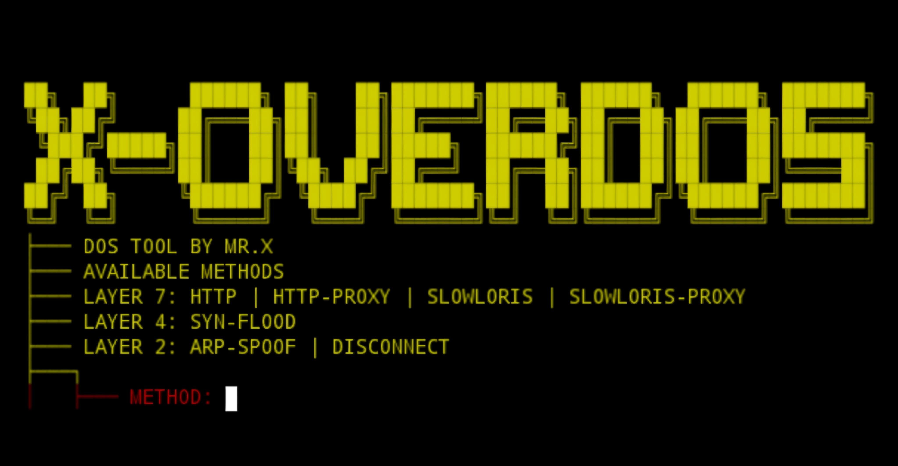

# X-overdos


## introduction
**X-overdos** is a A tool for performing DoS attack tests with many methods such as Layer 2, Layer 4, and also Layer 7.

## Instalations for Linux
```
$ sudo apt update -y && sudo apt upgrade -y
$ sudo apt install python3 python3-pip git -y
$ git clone https://github.com/Whomrx666/X-overdos.git
$ cd X-overdos
$ make setup
$ make run
```
---
## Instalations for Termux
```
$ pkg update -y && pkg upgrade -y
$ pkg install git
$ pkg install python -y
$ git clone https://github.com/Whomrx666/X-overdos.git
$ cd X-overdos 
$ pip install -r requirements.txt
$ python3 X-overdos.py
```
---
## Instructions
- **first**: Install tools according to the instructions above.
- **second**: Enter the tool and select the method you want to use.
- **third**: Enter the website address such as URL or IP address according to the method you chose previously.
- **Fourth**: Enter the threads and time as you wish.
- **Last**: Tools will start performing DoS attacks.
---
## Features
<br>

<div align="center">
  <h2>Layer 7 attack</h2><br>
</div>

`HTTP`: This attack consists of exhausting the victim by sending a huge amount of HTTP GET requests, eventually taking it down and preventing others to access its resources.

```
├─── DOS TOOL BY MR.X
├─── AVAILABLE METHODS
├─── LAYER 7: HTTP | HTTP-PROXY | SLOWLORIS | SLOWLORIS-PROXY
├───┐
│   ├───METHOD: HTTP
│   ├───TIME: 600
│   ├───THREADS: 800
│   └───URL: https://github.com/Whomrx666/X-overdos.git
```
---
`Slowloris`: Just like an HTTP attack, Slowloris also aims to block other users from accessing a certain resource, but it does that by connecting virtual hosts with a slow connection to the victim. The victim will eventually have a lot of slow connections open and will block new users from accessing its resources.

```
...
├───┐
│   ├───METHOD: SLOWLORIS
│   ├───TIME: 300
│   ├───THREADS: 200
│   ├───SLEEP TIME: 15
│   └───URL: https://github.com/Whomrx666/X-overdos.git
```
---
Both `HTTP` and `Slowloris` attacks have a proxy version. If you choose to use proxy, then the threads will initialize and connect to elite-anonymity public proxies, and if not, your IP will be used on the requests. We do not own the proxy servers and do not respond for anything that they may do (like leaking your actual IP); they are hosted by volunteers and their addresses are retrieved through the [Proxy Scrape API](https://docs.proxyscrape.com/).

<br>

<div align="center">
  <h2>Layer 4 attack</h2><br>
</div>

`SYN-Flood`: This attack relies on how the Tansmission Control Protocol (TCP) connections are designed. It takes advantage of the TCP 3-Way Handshake (SYN, SYN-ACK and ACK) by sending a lot of packets with the SYN flag, but never responding to the SYN-ACK packets sent by the victim, which makes it to wait forever with an open connection. If the victim somehow does not close the connection opened by the SYN packets, then it'll eventually block new connections.

```
...
├─── LAYER 4: SYN-FLOOD
├───┐
│   ├───METHOD: SYN-FLOOD
│   ├───TIME: 40
│   ├───THREADS: 10
│   └───URL: 192.168.0.1
```
---
<br>

<div align="center">
  <h2>Layer 2 attack</h2><br>
</div>

`ARP-Spoof`: This attack works on layer 2 of the OSI model, specifically on the Address Resolution Protocol (ARP). It consists of sending an adulterated packet to the victim saying that we are the gateway of the local network, so the victim must send all its packets to our machine. We also tell the gateway that we are the victim; that way we become the man in the middle of the connection and can inspect all of the victims' packets with an analyzer.

```
...
├─── LAYER 2: ARP-SPOOF | DISCONNECT
├───┐
│   ├─── METHOD: ARP-SPOOF
│   │
│   ├─── [!] Scanning Local Network...
│   │
│   ├─── Avaliable Hosts:
│   │
│   │     192.168.0.102
│   │     192.168.0.105
│   │
│   ├─── IP: 192.168.0.102
│   ├─── TIME: 100
```
---
`Disconnect`: It blocks the victim from accessing the internet on the local network during the time the attack is happening.

```
...
├─── LAYER 2: ARP-SPOOF | DISCONNECT
├───┐
│   ├─── METHOD: DISCONNECT
│   │
│   ├─── [!] Scanning Local Network...
│   │
│   ├─── Avaliable Hosts:
│   │
│   │     192.168.0.100
│   │     192.168.0.103
│   │     192.168.0.105
│   │
│   ├─── IP: 192.168.0.100
│   ├─── TIME: 600
```
---
# Layer7 testing!


## Observation
This is a tool for education only, I am not responsible for any misuse
### Original Author
<a href="https://github.com/Whomrx666"></a>

### <<< If you copy , Then Give me The Credits >>>

## CONNECT WITH ME :

[](https://whomrxhackers.blogspot.com/)
[](https://twitter.com/whomrx666)
[](https://youtube.com/@whomrxhackers)
[](https://facebook.com/https://www.facebook.com/whomrx.666)
[](https://t.me/@Whomr_X)
[](mailto:whomrx666@gmail.com)
[](https://www.tiktok.com/@whomr.x)

**If you want to donate, click on the button**
<a href="https://saweria.co/whomrx"></a>

### Visitors :
